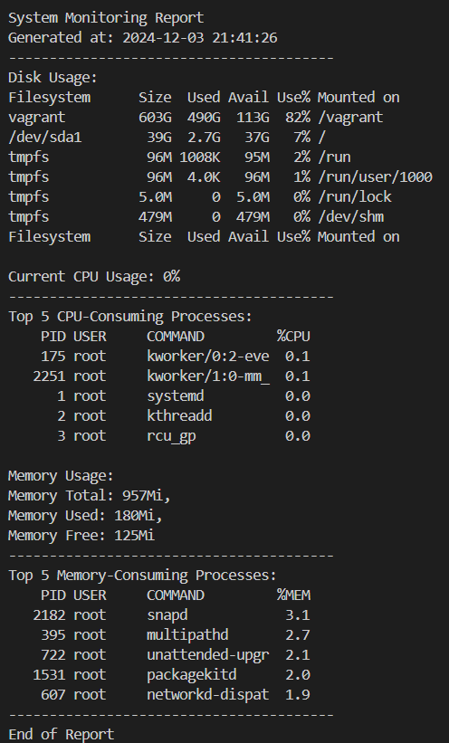

# System Resource Monitoring Script @ Oragne DevOps Internship

## Description
- The System Resource Monitoring Script is a powerful and customizable tool for tracking the health of a Linux system. It collects critical system metrics, generates detailed reports, and alerts administrators when resource usage surpasses predefined thresholds.
- It aims to assist system administrators in ensuring the smooth operation of servers by tracking disk usage, CPU load, memory consumption, and running processes.

## Packages 
```bash 
sudo apt-get install msmtp msmtp-mta
sudo apt install stress-ng
```
## Features

- **Disk Usage Monitoring**: Monitors disk usage and alerts if the disk usage exceeds a defined threshold.
- **Auto Sending Emails**: Automate sending warning emails if the disk usage exceeds a defined threshold.
- **CPU Usage Monitoring**: Reports current CPU usage percentage.
- **Memory Usage Monitoring**: Displays memory usage statistics, including total, used, and free memory.
- **Top Processes Monitoring**: Displays the top `n` processes sorted by CPU or memory usage.

## Requirements

This script is intended to run on Unix-based systems like Linux. The following commands are required:

- `df` (for disk usage)
- `top` (for CPU usage)
- `free` (for memory usage)
- `ps` (for process information)
- `msmtp` (for sending emails)

## Usage
**Caution**: Ensure to update the default email variable in the script if you do not specify one during execution with the -e option. Without a valid email address, the script may fail to send notifications.
### Options
```bash
# For normal use or CronJob
./script_name
```
- `./script_name.sh -t 50` <threshold>: Set the disk usage threshold for monitoring (default: 80%).
- `./script_name.sh -f mylogfile` <filename>: Set the filename for the generated report (default: monitoring_report_<current_date>.txt).
- `./script_name.sh -e example.gmail.com` <target_gmail> set the email for the sendemail (default: myemail.gmail.com)
- `./script_name.sh -h` : Show help message.

## Tool inner Functions

### 1. `help()`
**Parameters**: None  
- Displays the usage information and options for the script.

### 2. `send_email()`
**Parameters**: subject, body & email  
- Sends an email with the specified subject and body to the provided email address.

### 3. `check_disk_usage()`
**Parameters**: None
- Monitors the disk usage and sends an email if any disk usage exceeds the defined threshold.

### 4. `check_cpu_usage()`
**Parameters**:None  
- Reports the current CPU usage percentage.


### 5. `check_memory_usage()`
**Parameters**: None 
- Displays memory usage statistics including total, used, and free memory.

### 6. `get_top_processes()`
**Parameters**: n: Number of processes to display, order_by: Either cpu or mem to sort the processes by.
- Displays the top n processes ordered by either CPU or memory usage.


## Email Setup  

``` bash
# Copy the Mail system configuration file (replace 'msmtprc_conf_file' with the actual path to the config file)
cp msmtprc_conf_file ~/.msmtprc

# Open the file for editing to update your email and password
nano ~/.msmtprc

# Fix ownership to be the current user (replace `youruser` with your actual username)
sudo chown youruser:youruser ~/.msmtprc

# Set the correct file permissions for security
chmod 600 ~/.msmtprc
```
## CronJob
```bash
# Open Crontab
crontab -e
# Add the CronJob & save the changes

* * * * * /path/to/script_name.sh -t 80 -e your_email@example.com >> /path/to/logfiles/directory 
```

## For testing
``` bash
stress-ng --cpu 4 --cpu-load 80 --timeout 30
stress-ng --vm 2 --vm-bytes 75% --timeout 30
```


## Screenshots
 **Generate a log Report file** 


**Automatically sends detailed email alerts when thresholds are exceeded.**  
